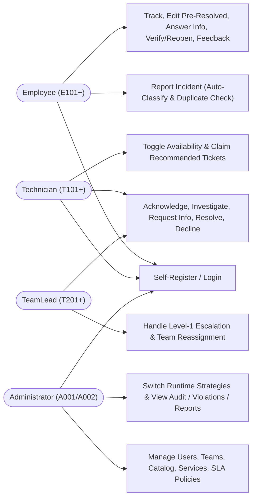
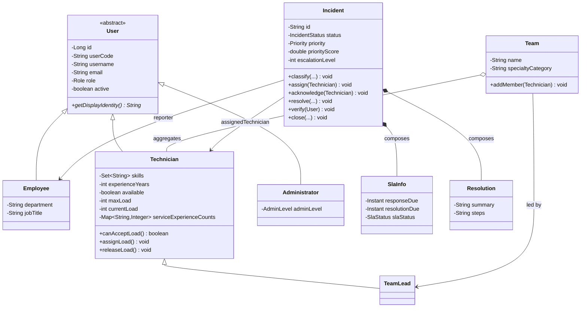
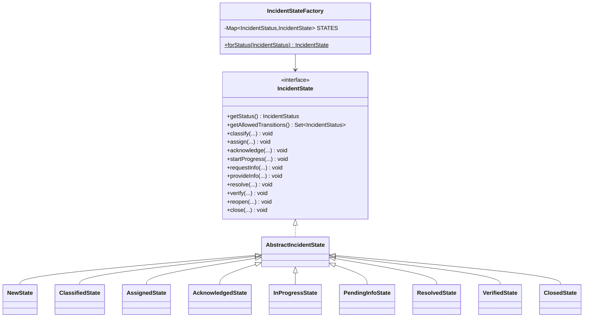
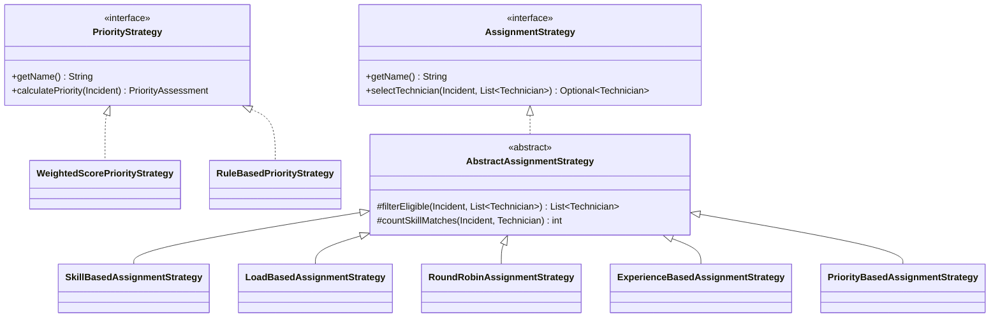
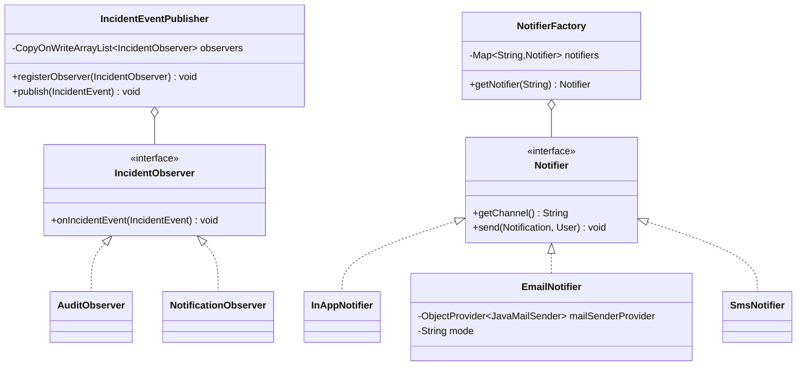

# UML Diagrams

## 1. Use-Case Diagram

```mermaid
flowchart LR
    Emp(["Employee (E101+)"])
    Tech(["Technician (T101+)"])
    Lead(["TeamLead (T201+)"])
    Adm(["Administrator (A001/A002)"])

    UC1["Self-Register / Login"]
    UC2["Report Incident (Auto-Classify & Duplicate Check)"]
    UC3["Track, Edit Pre-Resolved, Answer Info, Verify/Reopen, Feedback"]
    UC4["Acknowledge, Investigate, Request Info, Resolve, Decline"]
    UC5["Toggle Availability & Claim Recommended Tickets"]
    UC6["Handle Level-1 Escalation & Team Reassignment"]
    UC7["Manage Users, Teams, Catalog, Services, SLA Policies"]
    UC8["Switch Runtime Strategies & View Audit / Violations / Reports"]

    Emp --> UC1
    Emp --> UC2
    Emp --> UC3
    Tech --> UC1
    Tech --> UC4
    Tech --> UC5
    Lead --> UC4
    Lead --> UC6
    Adm --> UC1
    Adm --> UC7
    Adm --> UC8
```

## 2. User Hierarchy, Team Aggregation & Incident Composition

```mermaid
classDiagram
    class User {
        <<abstract>>
        -Long id
        -String userCode
        -String username
        -String email
        -Role role
        -boolean active
        +getDisplayIdentity()* String
    }
    class Employee {
        -String department
        -String jobTitle
    }
    class Technician {
        -Set~String~ skills
        -int experienceYears
        -boolean available
        -int maxLoad
        -int currentLoad
        -Map~String,Integer~ serviceExperienceCounts
        +canAcceptLoad() boolean
        +assignLoad() void
        +releaseLoad() void
    }
    class TeamLead
    class Administrator {
        -AdminLevel adminLevel
    }
    class Team {
        -String name
        -String specialtyCategory
        +addMember(Technician) void
    }
    class Incident {
        -String id
        -IncidentStatus status
        -Priority priority
        -double priorityScore
        -int escalationLevel
        +classify(...) void
        +assign(Technician) void
        +acknowledge(Technician) void
        +resolve(...) void
        +verify(User) void
        +close(...) void
    }
    class SlaInfo {
        -Instant responseDue
        -Instant resolutionDue
        -SlaStatus slaStatus
    }
    class Resolution {
        -String summary
        -String steps
    }

    User <|-- Employee
    User <|-- Technician
    Technician <|-- TeamLead
    User <|-- Administrator
    Team o-- Technician : aggregates
    Team --> TeamLead : led by
    Incident *-- SlaInfo : composes
    Incident *-- Resolution : composes
    Incident --> Employee : reporter
    Incident --> Technician : assignedTechnician
```

## 3. State Pattern

```mermaid
classDiagram
    class IncidentState {
        <<interface>>
        +getStatus() IncidentStatus
        +getAllowedTransitions() Set~IncidentStatus~
        +classify(...) void
        +assign(...) void
        +acknowledge(...) void
        +startProgress(...) void
        +requestInfo(...) void
        +provideInfo(...) void
        +resolve(...) void
        +verify(...) void
        +reopen(...) void
        +close(...) void
    }
    class AbstractIncidentState
    class IncidentStateFactory {
        -Map~IncidentStatus,IncidentState~ STATES
        +forStatus(IncidentStatus)$ IncidentState
    }

    IncidentState <|.. AbstractIncidentState
    AbstractIncidentState <|-- NewState
    AbstractIncidentState <|-- ClassifiedState
    AbstractIncidentState <|-- AssignedState
    AbstractIncidentState <|-- AcknowledgedState
    AbstractIncidentState <|-- InProgressState
    AbstractIncidentState <|-- PendingInfoState
    AbstractIncidentState <|-- ResolvedState
    AbstractIncidentState <|-- VerifiedState
    AbstractIncidentState <|-- ClosedState
    IncidentStateFactory --> IncidentState
```

## 4. Strategy Pattern

```mermaid
classDiagram
    class PriorityStrategy {
        <<interface>>
        +getName() String
        +calculatePriority(Incident) PriorityAssessment
    }
    class WeightedScorePriorityStrategy
    class RuleBasedPriorityStrategy

    class AssignmentStrategy {
        <<interface>>
        +getName() String
        +selectTechnician(Incident, List~Technician~) Optional~Technician~
    }
    class AbstractAssignmentStrategy {
        <<abstract>>
        #filterEligible(Incident, List~Technician~) List~Technician~
        #countSkillMatches(Incident, Technician) int
    }

    PriorityStrategy <|.. WeightedScorePriorityStrategy
    PriorityStrategy <|.. RuleBasedPriorityStrategy
    AssignmentStrategy <|.. AbstractAssignmentStrategy
    AbstractAssignmentStrategy <|-- SkillBasedAssignmentStrategy
    AbstractAssignmentStrategy <|-- LoadBasedAssignmentStrategy
    AbstractAssignmentStrategy <|-- RoundRobinAssignmentStrategy
    AbstractAssignmentStrategy <|-- ExperienceBasedAssignmentStrategy
    AbstractAssignmentStrategy <|-- PriorityBasedAssignmentStrategy
```

## 5. Observer, Factory & Notifier Adapter

```mermaid
classDiagram
    class IncidentEventPublisher {
        -CopyOnWriteArrayList~IncidentObserver~ observers
        +registerObserver(IncidentObserver) void
        +publish(IncidentEvent) void
    }
    class IncidentObserver {
        <<interface>>
        +onIncidentEvent(IncidentEvent) void
    }
    class AuditObserver
    class NotificationObserver
    class NotifierFactory {
        -Map~String,Notifier~ notifiers
        +getNotifier(String) Notifier
    }
    class Notifier {
        <<interface>>
        +getChannel() String
        +send(Notification, User) void
    }
    class InAppNotifier
    class EmailNotifier {
        -ObjectProvider~JavaMailSender~ mailSenderProvider
        -String mode
    }
    class SmsNotifier

    IncidentEventPublisher o-- IncidentObserver
    IncidentObserver <|.. AuditObserver
    IncidentObserver <|.. NotificationObserver
    NotifierFactory o-- Notifier
    Notifier <|.. InAppNotifier
    Notifier <|.. EmailNotifier
    Notifier <|.. SmsNotifier
```
